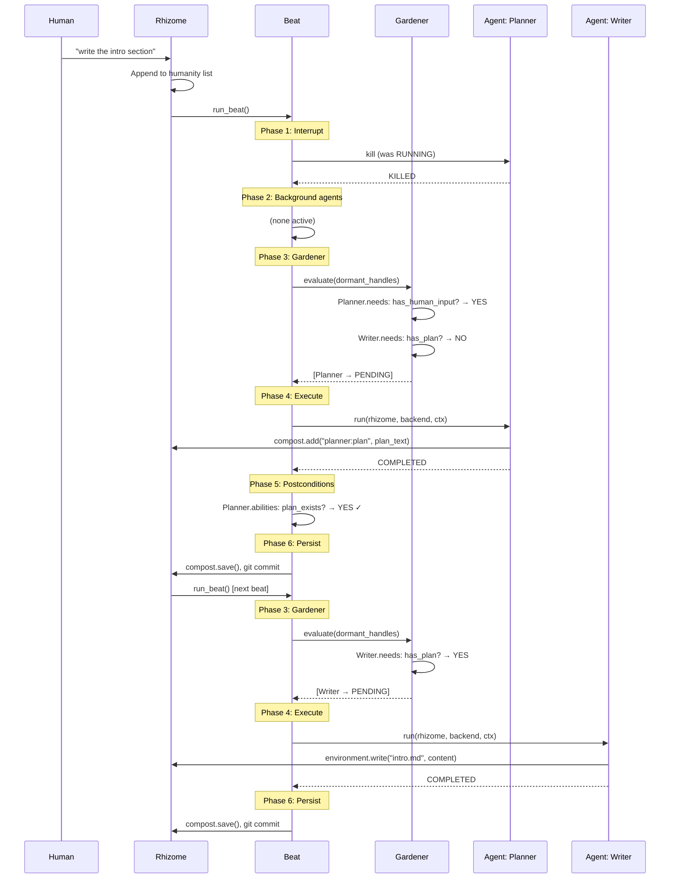

# 10^4 maxima

> "The tree imposes the verb 'to be,' but the fabric of the rhizome is the conjunction, 'and... and... and...'"
> — Deleuze & Guattari, *A Thousand Plateaus*

Rhizome is a non-hierarchical multi-agent orchestration system built on [mellea](https://github.com/ibm/mellea). There is no coordinator. Agents activate when their preconditions are met against shared state. Human input is one signal among many — it lands in the compost pile like everything else and triggers the same need-satisfaction machinery that governs all agent activation.

## Architecture Overview

```
rhizome/
  __init__.py          # Public exports
  rhizome.py           # Rhizome class — shared blackboard, not coordinator
  agent.py             # Agent (frozen Hoare triple), AgentHandle (mutable runtime state)
  beat.py              # Beat loop + BeatRecord
  compost.py           # CompostPile, CompostEntry
  gardener.py          # Gardener — mechanical need-checker, not decision-maker
  context_views.py     # GlobalRhizomeView, RhizomeAgentAnthology, GardenerView
  environment.py       # Git-backed environment management
  human.py             # HumanInput, humanity list
```

## Key Abstractions

### Agent

An Agent is a frozen Hoare triple:

```python
Agent(
    name: str,
    needs: tuple[Requirement, ...],       # preconditions
    fun: MelleaProgram,                    # the program itself
    abilities: tuple[Requirement, ...],    # postconditions
    background: bool = False,             # survives human interrupts
)
```

`needs` and `abilities` are tuples of mellea `Requirement` objects. A Requirement can be purely functional (a `validation_fn` that inspects state) or LLM-as-judge (a `description` string evaluated by the backend). Either form works with the gardener's activation check.

`fun` is any async callable with signature:

```python
async def my_agent(rhizome: Rhizome, backend: Backend, ctx: Context) -> None
```

Agents are immutable definitions. They describe *what* an agent is, not *where* it is in its lifecycle.

### AgentHandle

AgentHandle is the mutable runtime wrapper around an Agent:

```
DORMANT → PENDING → RUNNING → COMPLETED
                             → FAILED
                             → KILLED
```

- **DORMANT**: Registered but needs not yet satisfied. The gardener checks these each beat.
- **PENDING**: Needs satisfied, queued for execution this beat.
- **RUNNING**: Currently executing.
- **COMPLETED**: Finished successfully. Postconditions will be asserted.
- **FAILED**: Raised an exception. Logged to compost.
- **KILLED**: Terminated by human interrupt or another agent.

An agent may re-register itself with changed needs before completing, effectively scheduling a future wake-up.

### Rhizome

The Rhizome is a shared blackboard, not a scheduler. It holds:

- **Agent registry**: All registered AgentHandles and their current states.
- **CompostPile**: Append-mostly log of agent summaries, artifacts, and state.
- **Environment**: Git-backed file system for the artifact under construction.
- **Humanity list**: Chronological log of human inputs.
- **Backend**: The mellea Backend used for LLM calls (requirement validation, agent programs).

The Rhizome does not decide what runs. The beat cycle and gardener handle activation mechanically based on precondition satisfaction.

### CompostPile

An append-mostly log with soft supersession. Each `CompostEntry` has:

- `key`: Unique identifier (typically `"{agent_name}:{topic}"`).
- `content`: The data (string, summary, artifact reference).
- `author`: Which agent wrote it.
- `timestamp`: When it was written.
- `supersedes`: Optional key of the entry this one replaces.

Superseded entries are retained but marked stale. Queries default to active entries only. The compost pile serializes to JSON in `.rhizome/compost.json` and is committed each beat.

### Context Views

Custom mellea `Context` subclasses that provide filtered views of rhizome state:

- **GlobalRhizomeView**: High-level summary — active agents, recent compost entries, environment status. Used as context for agent programs that need situational awareness.
- **RhizomeAgentAnthology**: History of what agents have done — completed runs, their summaries, the order of events. Used for agents that need to understand the project's history.
- **GardenerView**: Synthetic context built from the current rhizome state, used by `Requirement.validate()` during the gardener's activation check. Contains a synthetic `ModelOutputThunk` representing the current state so requirements can evaluate against it.

## Beat Cycle

The beat is the fundamental clock of the rhizome. Each beat executes six phases:

### Phase 1: Interrupt

If human input arrived since the last beat, kill all non-background agents (transition RUNNING/PENDING → KILLED). Log kills to compost.

### Phase 2: Background Agents

Run background agents sequentially. These are long-lived watchers (divergence guards, monitors). They run every beat regardless of human input.

### Phase 3: Gardener Evaluation

The Gardener iterates all DORMANT agent handles. For each, it validates every `need` via `Requirement.validate(backend, gardener_view)`. If all needs pass, the handle transitions DORMANT → PENDING.

The Gardener is mechanical — it does not decide *whether* to activate an agent, only *whether its preconditions are met*. The decision was made when the agent was registered with those needs.

### Phase 4: Concurrent Execution

All PENDING agents run concurrently, bounded by an asyncio semaphore (default: 4). Each agent receives the Rhizome, the Backend, and its own context view. On completion, handles transition to COMPLETED or FAILED.

### Phase 5: Postcondition Assertion

For each COMPLETED agent, validate its `abilities` against current state. Discrepancies are logged to compost as warnings — they do not block or roll back. This is observational, not enforcement.

### Phase 6: Persist

Summarize the beat (what ran, what activated, what failed). Persist compost pile to `.rhizome/compost.json`. Git commit the environment and compost state.

## Sequence Diagram



## Agent Composition

Agents compose indirectly through shared state. One agent's `abilities` describe what it makes true; another agent's `needs` describe what must be true before it runs. The rhizome and gardener connect them mechanically.

### Example: Functional Requirement

```python
def has_plan(ctx: Context) -> ValidationResult:
    """Check if a plan exists in the compost pile."""
    # validation_fn receives the GardenerView context
    # which contains current compost state as CBlocks
    last = ctx.last_output()
    if last and "plan:" in (last.value or ""):
        return ValidationResult(True)
    return ValidationResult(False, reason="No plan found")

planner = Agent(
    name="planner",
    needs=(Requirement(validation_fn=lambda ctx: ...),),  # needs human input
    fun=plan_function,
    abilities=(Requirement(validation_fn=has_plan),),
)

writer = Agent(
    name="writer",
    needs=(Requirement(validation_fn=has_plan),),         # needs plan to exist
    fun=write_function,
    abilities=(),
)
```

The planner's completion deposits a plan into compost. Next beat, the gardener checks the writer's needs, finds the plan, and activates the writer. No agent calls another directly.

### Example: LLM-as-Judge Requirement

```python
writer = Agent(
    name="writer",
    needs=(Requirement("A detailed project plan exists in the compost pile"),),
    fun=write_function,
    abilities=(Requirement("The intro section has been written and committed"),),
)
```

Here the gardener uses the backend to evaluate the natural-language requirement against the GardenerView context. This is more flexible but costs an LLM call per dormant agent per beat.

## Edge Cases

### Simultaneous Activation

Multiple agents may activate in the same beat. They run concurrently with semaphore-bounded parallelism. Agents must tolerate concurrent reads/writes to the compost pile — CompostPile operations are thread-safe via asyncio locks.

### Failure Handling

If an agent raises an exception, its handle transitions to FAILED. The exception and traceback are logged as a compost entry. Other agents in the same beat are unaffected. A failed agent can be re-registered (manually or by another agent) to retry.

### Postcondition Contradictions

If agent A's postcondition check contradicts agent B's (e.g., A claims "plan exists" while B's postcondition claims "plan is stale"), both are logged. Postconditions are observational — the compost pile records the contradiction, and a future agent (or human) resolves it.

### Stale Beat Detection

If a beat produces no activations, no background agent output, and no human input is pending, the rhizome enters a quiescent state. It can be woken by new human input or an external event.

### Bootstrap

The system needs at least one agent whose `needs` are either empty or satisfiable from initial state (e.g., "human input exists"). Typically a bootstrap agent with `needs=()` runs on the first beat to set up initial compost state, or the first human input activates a listener agent.
